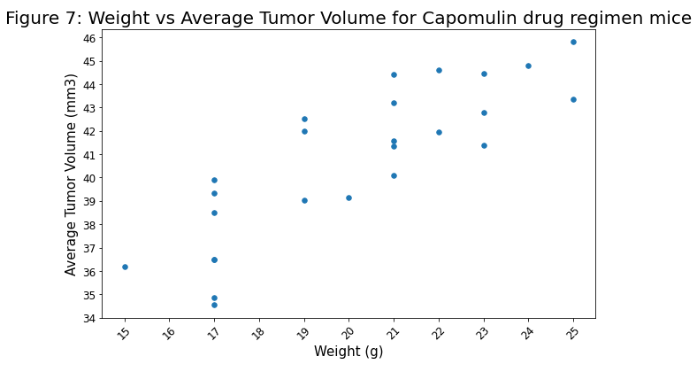

# Pymaceuticals Tumor Treatement Analysis

The repository analyses data supplied by Pymaceuticuals. Pymaceuticuals is a hypothetical pharaceuticuals manufacturer currently screening for potential treatments for squamous cell carcinoma (SCC), a commonly occurring form of skin cancer.The data consists of 45 days of observations of 249 mice identified with SCC tumour growth who were treated through a variety of drug regimens.

The data analysis found the following
#### Observation 1: In the Capomulin drug regimen cohort, heavier mice have larger tumors
According to figures 7 and 8, there appears to be a strong correlation between mouse weight and tumor size for mice in the Capomulin drug regimen cohort. This may infer that heavier mice have larger tumors overall, although more research is needed.

 

#### Observation 2: Capomulin appears to be effective in reducing tumor size
According to figure 6, Capomulin appears to be effective in reducing tumor size. Mouse b128 has shown an overall decrease during the course their treatment with this drug, which may suggest the drug is effective at treating tumors. However, more research is needed to assess its effectiveness on other mice treated with this drug.

 

#### Observation 3: Capomulin and Ramicane appear to be more effective than Infubinol or Ceftamin.
According to figure 5, mice treated with Capomulin and Ramicane have smaller tumors at the end of their treatment, when compared with mice treated with Infubinol or Ceftamin. Mice treated with Capomulin and Ramicane appear have lower median tumor sizes at the end of their treatment than mice treated with either Infubinol or Ceftamin. This may suggest that Capomulin and Ramicane are more effective at treating tumors although more research is needed to assess this assertion.

 

#### Observation 4: The distribution of female and male mice is roughly even
According to figures 3 and 4, the distribution of female and male mice observed is roughly even.

 

#### Observation 5: Capomulin and Ramicane have the most data points
According to figures 1 and 2, Capomulin and Ramicane have the most data points. This may infer that mice treated with these drugs survived for longer and thus may further indicate that they are the most effective drug treatments from the study.

 

## Tools/Packages used
- Python
  - Pandas
  - Matplotlib

 

## How to use
- Download the repository
- Open Git Bash and type `jupyter notebook`
- Go to the **Pymaceuticals** folder and open the [jupyter notebook script](Pymaceuticals/pymaceuticals_James-Akerman.ipynb).
